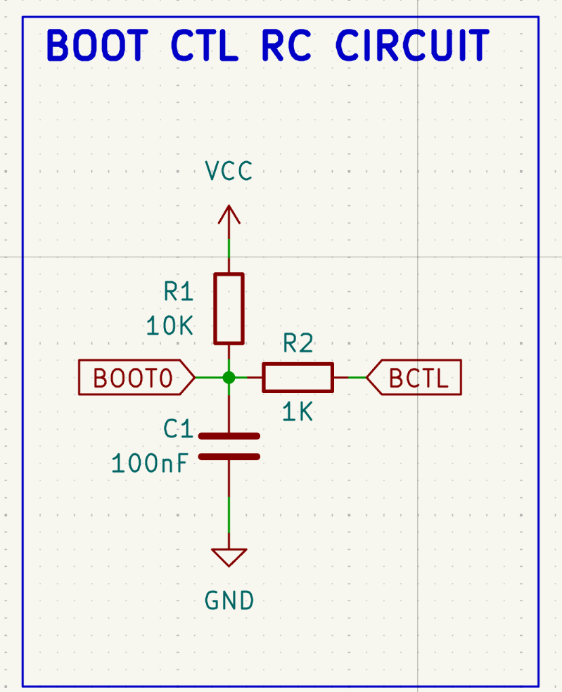
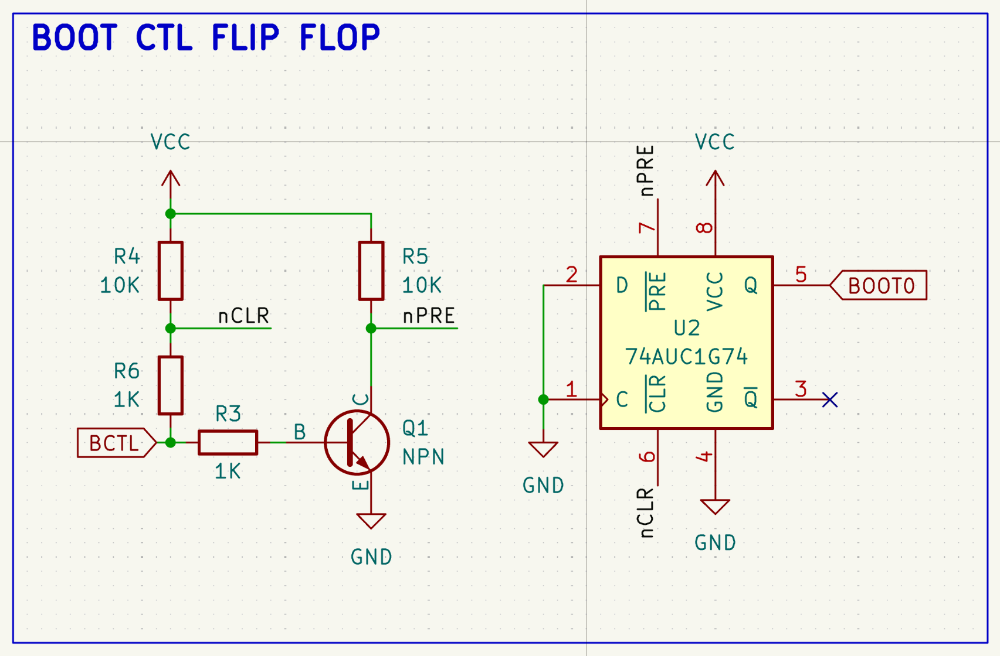

# GPIO-Controlled Boot Mode Selection

Some MCUs (e.g. CH32V103) use hardware boot pins (BOOT0/BOOT1) to select the boot
source at reset. If you choose to run tinyboot from system flash, you need BOOT0
to default HIGH on power-on (system flash), and provide a way for firmware to
switch to user flash (BOOT0 LOW) across a reset.

This document describes two circuits for controlling BOOT0 from a single GPIO pin
(BOOT_CTL). Both share the same firmware interface.

Note: BOOT1 is tied to GND in both circuits.

## BOOT_CTL GPIO Truth Table

| BOOT_CTL           | Effect                        |
| ------------------ | ----------------------------- |
| HIGH               | Boots system flash (tinyboot) |
| LOW                | Boots user flash (app)        |

## Circuit Option 1: RC (Recommended)

**How it works:**

- R1 (10K) pulls BOOT0 HIGH by default (system flash).
- When BOOT_CTL drives LOW, it overpowers the pull-up through R2 (1K), pulling
  BOOT0 LOW and discharging C1.
- On reset, the GPIO goes Hi-Z. The discharged capacitor holds BOOT0 LOW long
  enough for the chip to sample it (RC time constant = 10K x 100nF = 1ms).
- The capacitor then recharges through R1, returning BOOT0 to HIGH. On any
  subsequent reset, the chip boots back into system flash automatically.

**Tested:** Yes, verified on CH32V103C8T6. The RC time constant of 1ms provides
sufficient hold time across a software-triggered system reset. The capacitor
charges fast enough during power-on reset (POR) that BOOT0 reads HIGH on first
boot.

## Circuit Option 2: Flip-Flop

**How it works:**

- The NPN transistor inverts BOOT_CTL to drive /PRE (active-low preset).
- BOOT_CTL drives /CLR (active-low clear) directly through a 1K series resistor.
- When BOOT_CTL = HIGH: transistor ON, /PRE = LOW (active), Q = HIGH (system flash).
- When BOOT_CTL = LOW: transistor OFF, /CLR = LOW (active), Q = LOW (user flash).
- When BOOT_CTL = Hi-Z (during reset): transistor OFF (/PRE inactive via pull-up),
  /CLR inactive (via pull-up). The flip-flop holds its previous state.
- The two 1K series resistors isolate the transistor base from /CLR, preventing
  the /CLR pull-up from turning on the transistor during Hi-Z.

**Power-on state:** The 74AUC1G74 does not have a guaranteed power-on state. An
optional 100nF capacitor from /PRE to GND can be added to force Q HIGH on first
power-up.

**Tested:** Not yet verified on hardware. The design is sound in theory but has not
been tested. Let me know if you can confirm that it works.

## Which to Choose

The RC circuit is simpler (3 passive components, no IC) and has been validated on
hardware. It relies on the capacitor holding BOOT0 LOW for ~1ms across a reset,
which is well within the margin for software-triggered resets.

The flip-flop circuit is deterministic (no timing dependency) and holds state
indefinitely, but requires more components and has not been tested. It may be
preferable in designs if you need reliable state retention, e.g. a real product
that requires high reliability.

For most use cases though, my personal opinion is the RC circuit is probably reliable
enough and simpler / lower cost.
